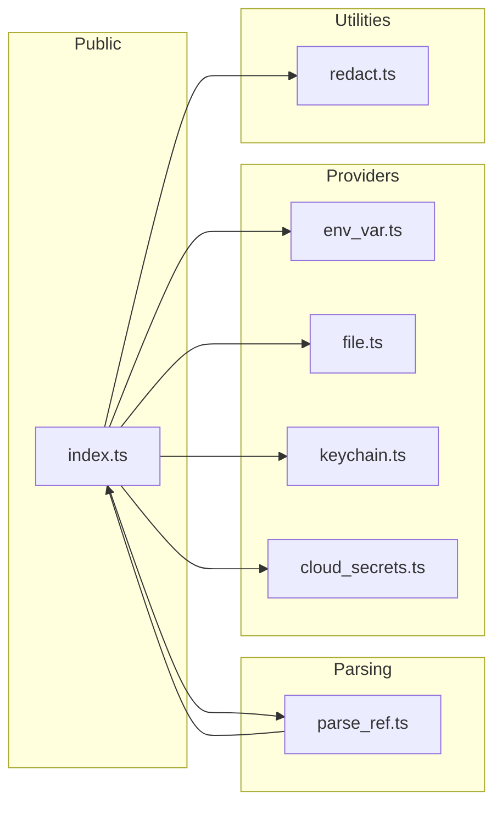
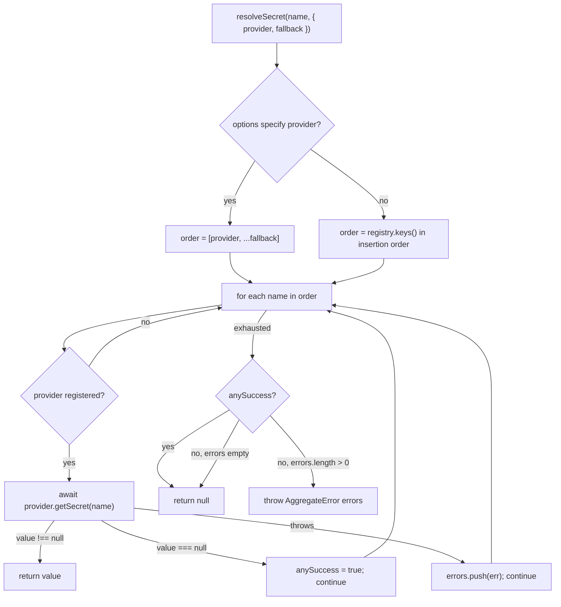
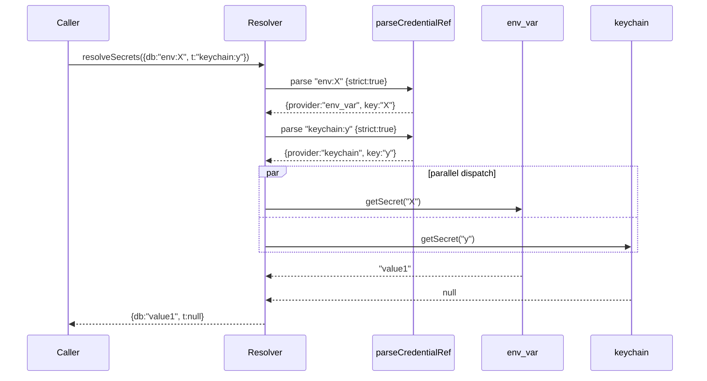
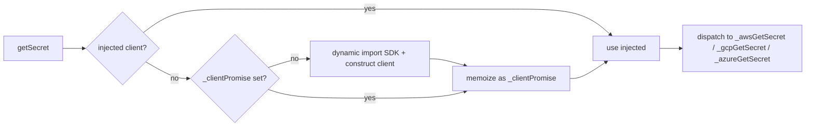

# Architecture

`@narai/credential-providers` is a pluggable secret-resolution layer for Node
applications. The README covers *how* to use the library; this document
explains *why it is shaped the way it is* so that contributors can extend
it without breaking invariants.

Scope: everything under `src/` and its interaction with the optional peer
SDKs loaded by `cloud_secrets.ts` and `keychain.ts`. Benchmarks, CI, and
release plumbing are referenced but not exhaustively documented — see
`bench/README.md` and `.github/workflows/` for those.

---

## 1. Design goals

The library optimizes for four properties, listed in priority order when
they conflict:

1. **Zero runtime dependencies.** `package.json` has no `dependencies`
   field. Everything the library uses at runtime is either standard Node
   or a peer dependency resolved through dynamic `import()` only when its
   code path actually runs. Callers pay only for what they use.

2. **Drop-in interchangeability.** Every backend implements the same
   two-method `CredentialProvider` interface, so an application can swap
   `env_var` → `keychain` → `cloud_secrets` without touching call sites.

3. **Fail-soft chains.** Secret resolution tries a primary provider first,
   then falls back through any number of alternatives. A missing secret is
   not an error; a thrown error in one provider does not short-circuit the
   chain. Only when *every* provider throws does the caller see an
   aggregate failure.

4. **Isolation where it matters.** A module-level registry (`defaultResolver`)
   is provided for convenience, but callers that need per-tenant or
   per-plugin isolation can instantiate their own `CredentialResolver`.
   The free functions (`resolveSecret`, `registerProvider`, …) are bound
   methods on the singleton — the class is the source of truth.

Almost every non-obvious detail below — reference-string URI parsing, the
POSIX mode check on `FileProvider`, the lazy SDK loader, the
`AggregateError` behaviour of `resolveSecret` — traces back to one of these
four goals.

---

## 2. Module layout

```
src/
├── index.ts          # public surface; CredentialResolver + defaultResolver
├── parse_ref.ts      # reference-string grammar
├── env_var.ts        # EnvVarProvider
├── file.ts           # FileProvider (JSON on disk + POSIX mode check)
├── keychain.ts       # KeychainProvider (macOS/Linux/Windows)
├── cloud_secrets.ts  # CloudSecretsProvider (AWS/GCP/Azure dispatcher)
└── redact.ts         # redact / redactAll utilities
```

The dependency graph is shallow — providers import only types from
`index.ts`, not the resolver itself, so they compose without cycles:



`index.ts` and `parse_ref.ts` do co-depend — `parse_ref.ts` needs the
`CredentialResolver` type to consult the registry, while `index.ts`
re-exports `parseCredentialRef` and calls it from `resolveSecrets`. The
cycle is type-only plus a default-resolver reference; TypeScript and
Node's ESM loader both resolve it correctly.

---

## 3. Core abstractions

### 3.1 `CredentialProvider`

```ts
interface CredentialProvider {
  getSecret(name: string): Promise<string | null>;
  describeSecret?(name: string): Promise<SecretMetadata | null>;
}
```

The *entire* contract is:

| Method           | Required | Returns                                         |
| ---------------- | -------- | ----------------------------------------------- |
| `getSecret`      | yes      | `string` on hit, `null` on miss, `throw` on error |
| `describeSecret` | no       | `SecretMetadata` object, `null` if not applicable |

Two contracts worth internalizing:

- **`null` means miss, not error.** A provider that can't find the secret
  returns `null`. The chain treats `null` as "I ran successfully and the
  secret isn't in my backend" and falls through.
- **`throw` means the backend itself failed.** Network outage, permission
  denied, malformed config. These are collected by the resolver and
  propagated only if every provider in the chain throws.

Every built-in provider adheres to this: a missing keychain item, a
missing env var, a missing AWS secret, a missing GCP secret, a missing
Azure secret — all map to `null`, not exceptions. The provider-specific
"not found" detection lives in small helpers (`_isMissingKeychainItem`,
`_isAwsNotFound`, `_isGcpNotFound`, `_isAzureNotFound`) that each
encapsulate the error-shape knowledge for their backend.

### 3.2 `SecretMetadata`

```ts
interface SecretMetadata {
  exists: boolean;
  version?: string;
  lastModified?: Date;
  provider: string;
}
```

Exists-checks without value leakage. All four built-ins implement
`describeSecret`; only `FileProvider` currently fills `lastModified`
(from `fs.statSync(...).mtime`). Cloud providers could eventually populate
`version` and `lastModified` from the SDK response — the contract is
designed to grow into that.

### 3.3 `CredentialResolver`

A thin registry plus the `resolveSecret`/`resolveSecrets` methods. The
registry is a plain `Map<string, CredentialProvider>`, so insertion order
is preserved — relevant because `resolveSecret(name)` with *no* options
falls back to iterating the registry in insertion order.

```ts
class CredentialResolver {
  register(name: string, provider: CredentialProvider): void;
  get(name: string): CredentialProvider | undefined;
  clear(): void;
  list(): string[];
  resolveSecret(name, options?): Promise<string | null>;
  resolveSecrets(specs, options?): Promise<Record<string, string | null>>;
}
```

### 3.4 `defaultResolver` and the free functions

`defaultResolver` is a module-level `new CredentialResolver()`. The free
exports are bound methods:

```ts
export const registerProvider = defaultResolver.register.bind(defaultResolver);
export const resolveSecret    = defaultResolver.resolveSecret.bind(defaultResolver);
// …
```

Why bind? So that `resolveSecret` keeps its `this` context regardless of
how it's destructured or passed around. Consumers can write
`import { resolveSecret } from "@narai/credential-providers"` and use it
as a standalone function.

Two consequences:

- Anything that goes through the free functions shares one global
  registry. Libraries embedded in the same process can stomp on each
  other's registrations if they both use `registerProvider`.
- Anything that needs isolation (multi-tenant servers, libraries that
  don't want to touch a shared registry, tests) constructs its own
  `new CredentialResolver()` and avoids the free functions.

---

## 4. Resolution flow

### 4.1 `resolveSecret`



The invariant that makes this fail-soft is the `anySuccess` flag. A chain
of four providers in which the first three throw and the fourth misses
(returns `null`) will **return `null`, not throw**, because *somebody* ran
cleanly. Only when every provider fails does the caller see an
`AggregateError` carrying every original error in order.

The empty-chain case (no registered providers, no options) returns `null`.

### 4.2 `resolveSecrets` — parallel batch

`resolveSecrets({ db: "env:PGPASSWORD", token: "keychain:github" })`
parses *every* ref up front with `{ strict: true }` so configuration
typos surface before any network calls fire. Then it dispatches all
lookups via `Promise.allSettled` and zips results back by alias.

Error handling differs subtly from `resolveSecret`:

- Per-alias failures are wrapped (`new Error('resolveSecrets: alias
  "X" failed: ...')`) and collected into an `AggregateError` whose
  `.errors` are each alias-tagged. If any alias fails, the batch rejects.
- With `{ strict: true }`, misses (null results) also reject, listing the
  missing aliases.



---

## 5. Reference-string grammar

`parse_ref.ts` owns the grammar. Two input forms, interchangeable:

| Form | Example                                   |
| ---- | ----------------------------------------- |
| Bare | `env:PGPASSWORD`, `file:/etc/creds.json:db.password` |
| URI  | `env://PGPASSWORD`, `file:///etc/creds.json#db.password` |

### 5.1 Parsing steps

1. **Form detection.** The regex `/^[a-z][a-z0-9_+.-]*:\/\//i` decides
   between URI and bare. Matching schemes follow RFC 3986 (letter + alnum
   or `+ - .`).
2. **URI form split.** For `file://` the WHATWG `URL` parser is used —
   `file:` is one of the special schemes that treats the authority and
   path correctly. The fragment after `#` is folded into the FileProvider's
   native `<path>:<dotted.key>` shape, so the provider itself needs no
   URI awareness. Windows drive paths (`file:///C:/creds.json#user`) are
   preserved verbatim.
   For any other URI scheme the parser does a plain `.indexOf("://")`
   split — custom schemes are not authority-based under WHATWG rules, so
   the URL parser would fold `//` into the pathname unhelpfully.
3. **Bare form split.** First `:` splits provider from key. Leading colon
   (`:foo`) returns `null` — the key would start at position 0. Empty key
   returns `null`.
4. **Alias normalization.** `env` → `env_var`, `cloud` → `cloud_secrets`.
   Normalization happens *before* the known-set check, so the aliases are
   just display sugar, not gating.
5. **Known-set check.** The recognized provider set is the **union** of
   two sources:
   - `options.resolver.get(name) !== undefined` — any provider the caller
     has registered at runtime.
   - A hardcoded allowlist of built-in names: `env_var`, `keychain`,
     `file`, `cloud_secrets`.
   The built-in allowlist exists so that config validation can happen
   before provider instances are constructed ("validate config at
   startup, construct providers later"). Unknown names return `null` or,
   under `{ strict: true }`, throw `unknown credential provider '…'`.

### 5.2 Unknown prefixes behave like literals

A value like `mongodb://user:pw@host/db` parses to `null` because
`mongodb` isn't known, not because the string fails URI parsing. That
lets callers treat any config string as either a literal or a reference
without maintaining their own prefix list:

```ts
const ref = parseCredentialRef(value);
return ref === null ? value : await resolveSecret(ref.key, { provider: ref.provider });
```

`strict: true` flips this to a hard error — useful when the config
surface is *supposed* to be references only.

---

## 6. Built-in providers

### 6.1 `EnvVarProvider`

```ts
new EnvVarProvider({ prefix?: string })
```

Two-step lookup per `getSecret(name)`:

1. Try `process.env[name]` verbatim. Hit → return.
2. Normalize: replace runs of non-alphanumeric with `_`, trim leading /
   trailing `_`, uppercase. Apply the optional `prefix`. Look that up.

So `db-password` maps to `DB_PASSWORD`, `api.token` to `API_TOKEN`, and
with a `MYAPP_` prefix, `db-password` maps to `MYAPP_DB_PASSWORD`. The
verbatim pass exists so callers with a legacy `$MYOIDCLIENT_SECRET`-style
key that already matches a shell env-var convention don't pay for
normalization.

Empty-string values are treated as absent (`""` → `null`). This matches
conventional env-var semantics where an unset variable and an
explicitly-empty one are usually interchangeable.

### 6.2 `FileProvider`

```ts
new FileProvider({
  path: string;
  suppressWarning?: boolean;
  allowLoosePermissions?: boolean;
  cacheTtlMs?: number;
})
```

Backs an on-disk JSON file. Four interesting behaviours:

**(a) Two lookup strategies.** First, literal top-level key — preserves
the flat `{ "<name>": "<value>" }` contract and tolerates key names that
contain dots. If that doesn't resolve to a string and the name contains
a `.`, walk the object as a dotted path (`db-prod.username` →
`data["db-prod"]["username"]`). Non-string leaves or missing segments
return `null`.

**(b) POSIX mode check.** `fs.statSync(path).mode & 0o077` — if any
group or other bits are set, the provider throws with a `chmod 600`
hint. Matches OpenSSH's posture for private keys. Skipped on Windows
where `stat().mode` doesn't carry portable Unix bits. Override with
`allowLoosePermissions: true` (separate flag from `suppressWarning`,
which only controls the plaintext console warning).

**(c) Plaintext console warning.** First call per instance emits a
`console.warn` suggesting keychain / cloud as alternatives. One-shot,
gated by a `_warned` flag. Suppressible via `suppressWarning: true` — do
not use in production.

**(d) TTL cache.** Default `Infinity` (parse once, hold forever). Set
`cacheTtlMs` to a finite value to re-stat + re-read after expiry. The
mode check re-runs on each refresh, so a rotated file with newly-bad
permissions still gets caught. `clearCache()` forces a refresh on
demand.

The cache caches the *raw nested object*, not just top-level strings, so
dot-path traversal can look into subobjects without extra parsing.
Literal-key lookups still filter to strings in `getSecret`.

### 6.3 `KeychainProvider`

```ts
new KeychainProvider({
  platform?: NodeJS.Platform;
  account?: string;
  servicePrefix?: string;
})
```

Three platform backends, selected by `process.platform` (or the
injectable `platform` option for tests):

| Platform | Backend                  | Transport            |
| -------- | ------------------------ | -------------------- |
| `darwin` | `security find-generic-password -s <svc> -w` | `execFileSync`       |
| `linux`  | `secret-tool lookup name <svc>` (libsecret)  | `execFileSync`       |
| `win32`  | `@napi-rs/keyring` `Entry(service, account)` | Dynamic `import()`   |

Unknown platforms throw — there is no generic fallback.

Key details:

- **Service prefix composition.** If `servicePrefix: "com.example.app"`,
  a lookup for `db-password` actually queries `com.example.app.db-password`.
  Lets an application namespace its secrets under a single keychain
  entry group.
- **Not-found detection.** macOS `security` exits with status 44 for
  missing items; libsecret's `secret-tool` exits with 1 + empty stdout.
  Both map to `null`. Any other status propagates as a wrapped error
  that includes stderr.
- **Linux missing-tool detection.** If `secret-tool` isn't installed
  (`ENOENT`), throws a helpful `apt install libsecret-tools` hint.
- **Windows lazy load.** `@napi-rs/keyring` is an *optional* peer
  dependency — declared separately from `dependencies` so macOS and
  Linux users don't pay the native-binding install cost. The import is
  attempted only when `platform === "win32"`; missing-module errors are
  translated to a `npm install --save-dev @napi-rs/keyring` hint.

### 6.4 `CloudSecretsProvider`

```ts
new CloudSecretsProvider({
  subProvider: "aws" | "gcp" | "azure";
  awsRegion?: string;
  gcpProjectId?: string;
  gcpVersion?: string;
  azureVaultUrl?: string;
  cacheTtlMs?: number;
})
```

A dispatcher, not three separate classes. One instance handles one
sub-provider; multi-cloud callers register multiple instances under
distinct names.

**Client construction is lazy and memoized.** The SDK is loaded on first
`getSecret` call, the client is built once, and the promise is cached on
`_clientPromise`:



The SDK import happens inside `_buildClient` using `_loadOptional`, a
small wrapper that translates `ERR_MODULE_NOT_FOUND` /
`MODULE_NOT_FOUND` into a `npm install` hint. Non-module-missing errors
propagate unchanged.

**Test injection.** `CloudSecretsProvider.forTesting({ client, ...config })`
bypasses the dynamic import and uses the provided object as the client.
The injected flag (`_injectedClient !== undefined`) is also used by
`_awsGetSecret` to skip loading the `GetSecretValueCommand` class — for
tests, a plain `{ SecretId: name }` object is accepted, because the mock
client's `.send()` can match on shape.

**Per-sub-provider call shapes.**

- `aws` — `client.send(new GetSecretValueCommand({ SecretId: name }))`.
  Response has `SecretString` (UTF-8) or `SecretBinary` (`Uint8Array`,
  decoded as UTF-8). Not-found: `ResourceNotFoundException` (either
  `.name` or the older `.Code`).
- `gcp` — `client.accessSecretVersion({ name: "projects/<p>/secrets/<n>/versions/<v>" })`,
  where `<v>` defaults to `latest`. Response is `[{ payload: { data } }]`
  where `data` is a `Uint8Array` (or string depending on SDK version).
  Not-found: grpc status code `5`.
- `azure` — `client.getSecret(name)`. Response is
  `{ value?: string }`. Not-found: `SecretNotFound` code or
  HTTP 404.

**In-memory cache.** `cacheTtlMs` defaults to 0 (disabled). When
enabled, both hits and misses are cached for the configured window;
thrown errors are not cached. `clearCache()` purges the cache entirely —
useful after rotation events.

---

## 7. Error handling philosophy

Two core primitives:

- `null` return = "clean miss". The chain walks past.
- `throw` = "I tried and failed". The chain records, keeps going.

This maps onto two aggregator behaviours:

- `resolveSecret` throws `AggregateError` *only* if every provider threw.
  This prevents a transient cloud outage from breaking a chain that has
  a local fallback.
- `resolveSecrets` throws `AggregateError` if *any* alias fails — the
  batch is a unit. Individual errors are wrapped with
  `resolveSecrets: alias "X" failed: <original>` so the `.errors` array
  is self-describing when logged.

The `strict: true` option on `parseCredentialRef` lets config validation
fail early (typos → exceptions at startup, not silent misses at runtime).
`resolveSecrets` hardcodes `{strict: true}` on parsing for the same
reason, independent of the batch's own `strict` option (which controls
null-result behaviour).

---

## 8. Caching and concurrency

Two layers of caching, each opt-in and independent:

1. **`FileProvider`.** Parsed JSON cached on the instance; invalidated by
   TTL expiry or `clearCache()`. No locking — concurrent `getSecret`
   calls may race on the first `_load`, but the operation is idempotent
   (same disk, same parse), so the last writer wins with identical data.
2. **`CloudSecretsProvider`.** Per-name value cache plus a single
   `_clientPromise` that dedupes concurrent client construction. If two
   calls arrive before the client is built, both await the same promise.

Neither provider caches errors. A network blip on the first call will
re-attempt on the next.

`EnvVarProvider` and `KeychainProvider` don't cache — `process.env` reads
are already cheap, and keychain calls are expected to be rare and
sensitive to rotation.

---

## 9. Redaction

`redact.ts` is intentionally minimal: two functions, one hardcoded
minimum-length rule, no state.

```ts
redact(needle, haystack, placeholder?): string
redactAll(needles, haystack, placeholder?): string
```

Rules:

- Needles shorter than 4 characters are skipped. Short secrets collide
  with common English tokens ("api", "key", …) and would wreck log
  readability.
- Regex specials in the needle are escaped — safe to pass raw secret
  values.
- Global, case-sensitive replacement.
- Default placeholder `[REDACTED]`.

No Sentry/pino/winston integration ships in the library. The functions
are pure `(string, string) => string`, composable into any log
post-processing pipeline the caller already has.

---

## 10. Dependency surface

`package.json`:

```json
{
  "dependencies": {}  // none
  "devDependencies": {
    "@types/node": "^20",
    "tinybench":   "^4",
    "typescript":  "^5",
    "vitest":      "^3"
  }
}
```

The cloud and Windows-keychain packages are **peer dependencies** in
spirit, but not declared in `peerDependencies` — they're entirely
optional, load dynamically, and the library prints an install hint when
missing. Declaring them as peers would nag every caller with npm warnings
about unused optional deps.

| Peer package                            | Loaded by              | Install hint                                            |
| --------------------------------------- | ---------------------- | ------------------------------------------------------- |
| `@aws-sdk/client-secrets-manager`       | CloudSecretsProvider   | `npm install --save @aws-sdk/client-secrets-manager`    |
| `@google-cloud/secret-manager`          | CloudSecretsProvider   | `npm install --save @google-cloud/secret-manager`       |
| `@azure/keyvault-secrets` + `@azure/identity` | CloudSecretsProvider | `npm install --save @azure/keyvault-secrets`          |
| `@napi-rs/keyring`                      | KeychainProvider (win) | `npm install --save-dev @napi-rs/keyring`               |

Both `_loadOptional` implementations (in `keychain.ts` and
`cloud_secrets.ts`) translate `ERR_MODULE_NOT_FOUND` /
`MODULE_NOT_FOUND` into friendly errors; every other failure mode
surfaces unchanged.

---

## 11. Writing a custom provider

The whole extension path is:

```ts
import {
  type CredentialProvider,
  type SecretMetadata,
  registerProvider,
} from "@narai/credential-providers";

class VaultProvider implements CredentialProvider {
  async getSecret(name: string): Promise<string | null> {
    // Return null on miss, throw on genuine error.
  }

  // Optional — defaults to { exists, provider } via the resolver.
  async describeSecret(name: string): Promise<SecretMetadata> {
    const value = await this.getSecret(name);
    return { exists: value !== null, provider: "vault" };
  }
}

registerProvider("vault", new VaultProvider());
```

After `registerProvider`, references of the form `vault:my-key` or
`vault://my-key` parse automatically — the resolver's registry
contributes to `parseCredentialRef`'s known-set, so no grammar change is
needed.

Follow the existing conventions:

- **`null` on miss, throw on error.** Never use exceptions for signalling
  absence.
- **Wrap third-party errors.** Classify backend-specific "not found"
  into `null`; re-throw everything else as a wrapped error with enough
  context to diagnose.
- **Lazy-load optional SDKs.** Mirror the `_loadOptional` pattern if
  your provider needs a heavy dependency the caller might not want.
- **Don't cache errors.**

---

## 12. Build, test, release

- **Build.** `npm run build` runs `tsc` with `src/` as input, emitting
  ES modules and `.d.ts` declarations into `dist/`. `tsconfig.json`
  targets ES2022, uses ESNext modules with `Bundler` resolution, and
  enables `strict` + `noUncheckedIndexedAccess` (every indexed read
  returns `T | undefined`).
- **Tests.** `npm test` runs `vitest run`. Tests import directly from
  `src/…` with `.js` suffixes resolved by bundler-style module
  resolution — no build step required. Configuration in
  `vitest.config.ts`: `testTimeout: 10_000`, excludes `dist/` and
  `fixtures/`.
- **Benchmarks.** `npm run bench` runs `bench/run.mjs`, which imports
  four suites (`env_var`, `parse_ref`, `resolver`, `file`) and prints a
  combined `ops/s`-sorted table. The benches import from `dist/`, so
  build first.
- **CI.** `.github/workflows/ci.yml` runs `npm ci` → typecheck → tests
  → build on every push and PR to `main`. Ubuntu only — keychain and
  Windows paths are exercised via `platform` injection or mocks rather
  than real runners.
- **Release.** `.github/workflows/release.yml` fires on `v*.*.*` tags.
  It verifies that the tag version matches `package.json.version`
  byte-for-byte, runs the same typecheck+test+build gate, and
  `npm publish --access public --provenance`. Publication auth uses the
  `NPM_TOKEN` secret via `NODE_AUTH_TOKEN` (the workflow was set up with
  Trusted Publishing via OIDC, but the current configuration reverted to
  a classic token — see `CHANGELOG.md` / recent commits).

---

## 13. Security posture

`SECURITY.md` is the authoritative policy; this section summarizes what
the architecture does and does not protect against.

**In scope:**

- **Value protection in transit through the library.** Credentials
  retrieved by `getSecret` are never logged, never persisted, and never
  written into error messages by the library itself.
- **POSIX mode enforcement on `FileProvider`.** Group or world-readable
  credential files are refused unless the caller explicitly opts in.
- **Error-shape leakage.** Errors may include secret *names*, filesystem
  paths, and provider identifiers — but never values.

**Not in scope:**

- **Encryption at rest.** `FileProvider` reads plaintext JSON; callers
  needing at-rest encryption should use `keychain` or `cloud_secrets`.
- **Audit logging.** Out of scope — callers instrument this at the
  application layer.
- **Peer-SDK vulnerabilities.** Reported upstream to the respective SDK
  maintainers, not to this project.
- **Rotation.** Providers read; they do not write or schedule rotations.
  Callers integrate with their backend's native rotation workflow.

---

## 14. Glossary

| Term              | Meaning                                                            |
| ----------------- | ------------------------------------------------------------------ |
| **Provider**      | A class implementing `CredentialProvider`. One per backend.        |
| **Sub-provider**  | A branch inside `CloudSecretsProvider` (aws / gcp / azure).        |
| **Resolver**      | A `CredentialResolver` instance — registry + chain logic.          |
| **Reference**     | A `provider:key` or `provider://key` string understood by `parseCredentialRef`. |
| **Miss**          | `getSecret` returned `null`. Distinct from an error.               |
| **Chain**         | The ordered sequence of providers tried by `resolveSecret`.        |
| **Registry**      | The `Map<string, CredentialProvider>` inside a `CredentialResolver`. |
| **Default resolver** | The module-level `defaultResolver` shared by the free functions. |
